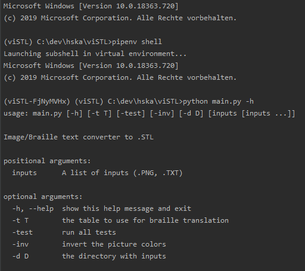

# ⠧⠊⠎⠞⠇ viSTL - visual to .STL

CLI App for converting Text and Images to 3D printable Braille and Reliefs



## ⭐ Features

- Convert .TXT files to .STL files containing braille
  - Supports all languages supported by [Liblouis](http://liblouis.org/)
    - Supports grade 1, 2 and 3 as well as 6-dot and 8-dot braille (depends on language)
- Convert .PNG files to .STL files containing reliefs
  - Can also invert images for different results

## 💡 [Examples](docs/examples.md)

## 🛠️ Development

These instructions will get you a copy of this project up and running on your local machine for development and testing purposes.

### 📋 Prerequisites

- [Python 2.7.16](https://www.python.org/downloads/) - Programming language that lets you work quickly and integrate systems more effectively
  - Make sure the installer sets up the following:
    - `pip`
    - `Add python.exe to Path`
      - This also adds `pip.exe` and more
- [Pipenv](https://github.com/pypa/pipenv) - Python Development Workflow for Humans
  - You don't need to download anything manually, just run `pip install pipenv`
- [PyCharm](https://www.jetbrains.com/pycharm/) - The Python IDE for Professional Developers
  - This setup guide contains steps for PyCharm, but you can use any editor you want

#### Windows

On Windows you additionally need to install [Microsoft Visual C++ Compiler for Python 2.7](http://aka.ms/vcpython27), which is required by the package `stl-tools`.

#### UNIX

On UNIX systems - if you want to use the text-to-stl feature - you additinally need to get the `lou_translate` executable from `liblouis` and add it to your `PATH` environment variable. How you can get `lou_translate` depends on your platform:

- Linux

  - There should be a `liblouis` package in all main Linux distributions, which you can use. Just to list a few:

    ```bash
    # Arch-based distros
    sudo pacman -S liblouis

    # Debian-based distros
    sudo apt-get install liblouis-bin
    ```

- macOS

  - You have to build `liblouis` yourself by following [this document](https://github.com/liblouis/liblouis/blob/master/HACKING). For that to work you need the following packages:

    ```bash
    brew install automake libtool pkg-config texinfo
    ```

### 🚀 Getting Started

#### Installing the dependencies

The project uses `pipenv` as the package and virtual environment manager. All the dependencies are declared in `Pipfile`. You can either let PyCharm install them or you can do it manually with any Terminal:

- PyCharm
  - PyCharm should automatically show appropriate notifications in a small yellow bar above the editor, where you just need to select the following options:
    1. `Use Pipenv interpreter`
    1. `Install requirements from Pipfile.lock`
- Terminal
  ```bash
  # run this in the project's root folder
  pipenv install
  ```

#### Running the program

Firstly, you'll need to get into the program's virtual environment:

```bash
# run this (and any following commands) in the project's root folder
pipenv shell
```

To get the list of possible CLI-arguments, run the program with the `-h` flag:

```bash
python main.py -h
```

| Parameter      | Description                                                          | Default         |
| -------------- | -------------------------------------------------------------------- | --------------- |
| `<positional>` | One or multiple input files separated by spaces                      |
| `-t`           | The language table liblouis should use (see `third/liblouis/tables`) | `de-g2.ctb`     |
| `-d`           | Input directory to search for input files if no inputs are specified | `workspace/in/` |
| `-inv`         | If set, all images will be inverted                                  | `False`         |
| `-test`        | If set, tests will be run instead of processing inputs               | `False`         |

Examples:

- Converting all .PNGs and .TXTs to .STL:

  - From default directory (`./workspace/in/`):

    ```bash
    python main.py
    ```

  - From specific directory:

    ```bash
    python main.py -d ./my/example/dir/
    ```

- Converting specific images to .STL:

  ```bash
  python main.py ./examples/hello_world.png ./examples/braille.png
  ```

- Inverting images:

  ```bash
  python main.py -inv
  ```

- Specifying the Braille language:

  ```
  python main.py ./examples/dickens.txt -t=en-GB-g2.ctb
  ```

## 🧰 Built With

### 📚 Resources

- [What is Braille](http://www.acb.org/tennessee/braille.html)
- [Python Unicode HOWTO](https://docs.python.org/2/howto/unicode.html)

### 🏛️ Libraries

- [Liblouis](http://liblouis.org/) - Braille translator and back-translator
- [Matplotlib](https://matplotlib.org/) - Comprehensive library for creating static, animated, and interactive visualizations in Python
- [NumPy](https://numpy.org/) - The fundamental package for scientific computing with Python
- [Pillow](https://python-pillow.org/) - The friendly Python Imaging Library fork
- [SciPy](https://www.scipy.org/) - Python-based ecosystem of open-source software for mathematics, science, and engineering
- [stl_tools](https://github.com/thearn/stl_tools) - Python code to generate STL geometry files from plain text, LaTeX code, and 2D numpy arrays (matrices)

## 👨‍💻 Authors

- Robin Hartmann - [robin-hartmann](https://github.com/robin-hartmann)
- Oleh Kuzmin - [olegkuzminvic](https://github.com/olegkuzminvic)
- Alexandr Timchenko - [atimchenko92](https://github.com/atimchenko92)

## 📃 License

This project is licensed under the MIT License - see the [LICENSE](LICENSE) file for details.

## 👍 Acknowledgments

- Special thanks to [Alex](https://github.com/atimchenko92) and [Oleh](https://github.com/olegkuzminvic) for letting me publish this project
